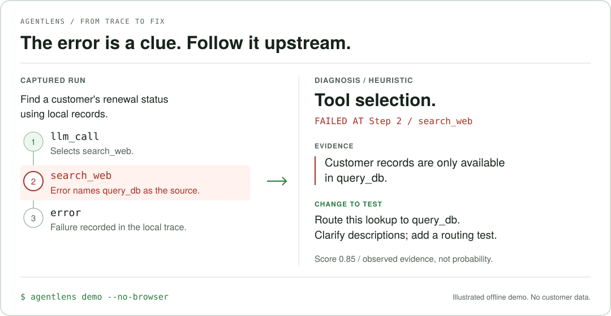

<p align="center">
  
</p>

<h1 align="center">AgentLens</h1>

<p align="center"><strong>Find the decision that broke your agent.</strong><br>
Local trace capture and evidence-based root-cause debugging.</p>

<p align="center">
  <a href="https://agentlens.run/">Website</a> ·
  <a href="#install-and-try">Quickstart</a> ·
  <a href="#verified-capture-scope">Supported providers</a> ·
  <a href="contribution.md">Contribute</a> ·
  <a href="https://github.com/agentlens-hq/agentlens/issues">Report a bug</a>
</p>

Your agent picked the wrong tool, repeated a failed call, or lost its goal.
AgentLens helps you follow the recorded evidence back to a specific step and
a concrete change to test. When the trace cannot support a cause, it reports
**insufficient evidence** rather than pretending certainty.

Beta support boundaries and current blockers are documented in the
[Modules 1-2 support contract](docs/module12_support.md) and
[beta completion report](docs/module12_beta_report.md).

- **Capture:** record supported model calls, tool selections/results, usage, and errors.
- **Inspect:** read the run in your terminal or open its local HTML timeline.
- **Diagnose:** get a category, original failed step, evidence, suggested fix, and confidence/source label.



*Illustration of the deterministic offline demo, not a dashboard screenshot or
customer run. See the [text output](#inspect-and-diagnose) or run
`agentlens demo --no-browser` to reproduce it.*

**Local by default · Python 3.9+ · Open source / [MIT](LICENSE) · Beta**

## Install and Try

Start with the current source for beta testing. This checkout is **0.1.3**;
[PyPI](https://pypi.org/project/runlens/) lists **0.1.2** as of September 16, 2026.
`pip install runlens` installs the published release, not necessarily the behavior
documented here. The Python package is named `runlens`; the import and CLI are `agentlens`.

```bash
git clone https://github.com/agentlens-hq/agentlens.git
cd agentlens
python -m venv .venv
source .venv/bin/activate
python -m pip install -e ".[openai,anthropic]"
agentlens doctor
agentlens demo --no-browser
```

On Windows, activate with `.venv\Scripts\activate` instead. Use the activated
environment's CLI; a global `agentlens` command may belong to an older install.

The demo captures a simulated broken agent, saves its trace, and prints a diagnosis.
It never calls a provider, even when API keys are set. No API key or account is
needed for this demo. Doctor checks local mechanics, not real-world diagnosis quality.

## Capture a Run

Two lines enable instrumentation; a decorator groups and **saves** the run.
Calling `init()` alone does not persist a grouped run.

```python
import agentlens
agentlens.init()

from openai import OpenAI
client = OpenAI()  # Uses your OPENAI_API_KEY for your own provider requests.

@agentlens.run(name="support_agent")
def support_agent(query):
    return client.chat.completions.create(
        model="gpt-4o-mini",
        messages=[{"role": "user", "content": query}],
    )

support_agent("Find the status of customer C17.")
```

This is an instrumentation example, not a complete customer lookup agent. Your own
OpenAI call requires `OPENAI_API_KEY` and provider access. Keep your existing model
configuration. For provider-specific examples, see [examples/](examples/).

<details>
<summary>Run lifecycle, async capture, and tool results</summary>

`async def` decorators and async provider clients are supported. Await child
tasks before the decorated function exits. Independent decorated agents get
separate run IDs; nested decorators create child runs. Detached background tasks
are not guaranteed to be persisted after their parent run finishes.

Run snapshots are saved to `.agentlens/runs/<run_id>.json`. Use
`agentlens.save_run()` inside a run for a partial snapshot. Save failures warn
without replacing your agent's result or original exception. Explicitly shared
save paths use atomic last-complete-snapshot replacement, not span merging.

Tool requests are captured from provider responses. Tool results are correlated
when submitted in the next provider request, or explicitly:

```python
agentlens.record_tool_result(
    tool_name="lookup", tool_use_id=call_id, input=arguments, output=result
)
```

Use a new provider call ID for each retry. Re-recording an existing ID updates
that result, including a legitimate `None` output.

Memory capture is explicit: `record_memory_snapshot(label, state)` copies JSON-like
state at your chosen boundary. Replay uses ENTER to advance, `b` to go back, `f`
for full captured span JSON and `d` to compare the latest two recorded snapshots.
Diffs show added/removed/changed fields; lists are compared as whole values.
Display truncation does not change comparison semantics. Replay never reruns an agent.

</details>

## Inspect and Diagnose

```bash
agentlens runs list
agentlens runs show <run_id>
agentlens diagnose <run_id>                    # Offline, even with API keys set
agentlens runs view <run_id>                   # Opens a local HTML timeline
```

<details>
<summary>More CLI commands</summary>

```bash
agentlens runs prompt <run_id> --step 2        # Original trace step, not LLM-call ordinal
agentlens runs replay <run_id>
agentlens runs stitch <run_id>
agentlens watch                               # Changed saved snapshots, not live event streaming
agentlens stats                               # All runs; known cost subtotal and unknown-price count
agentlens similar <run_id>
agentlens clusters
agentlens anonymize <run_id>
agentlens feedback-template <run_id>
agentlens evaluate
```

If no browser is available, `runs view` prints the generated HTML path instead.

</details>

Example from the deterministic demo, abbreviated:

```text
SOURCE:
  Heuristic fallback
ROOT CAUSE:
  tool_selection
FAILED AT (ROOT-CAUSE STEP):
  Step 2 (search_web)
WHY:
  Step 2 called 'search_web', but the tool error explicitly identifies
  'query_db' as the required tool; no successful retry is recorded.
SUGGESTED FIX (not verified):
  Route this operation to 'query_db', distinguish the tool descriptions,
  and add a routing regression test.
EVIDENCE STRENGTH: observed
Confidence score (not a calibrated probability): 0.85
```

Categories: `tool_selection`, `loop`, `cascade`, `context_pollution`,
`state_drift`, `overflow`. Local rules are intentionally narrow: explicit
routing errors, repeated failed calls without progress, downstream reuse of
flagged fields, or explicit evidence of conflicting instructions/goal/context
loss. Names, topics, repetition alone, and preprocessing truncation are not proof.
These rules do not reliably infer subtle semantic errors or model intent.

Scores express evidence strength, **not calibrated odds of correctness**.
A completed process is not proof of a correct answer. Partial/running/cancelled
runs retain their execution status. Absence of a detected failure is not a safety
certification. Hallucination checks cover constrained schema violations and
explicit same-entity field contradictions; they do not verify arbitrary facts.

## Verified Capture Scope

| Integration | Current scope |
| --- | --- |
| OpenAI / Python | Chat Completions and Responses; sync/async calls and supported streams |
| Anthropic / Python | Messages; sync/async calls and supported streams |
| LangGraph / Python | Patch before compilation; aggregate invoke and scoped updates-mode node capture |
| [Node SDK](agentlens_sdk_ts/README.md) | Awaited non-streaming OpenAI Chat and Anthropic Messages; not Python parity |
| CrewAI, AutoGen, PydanticAI | Conditional capture through supported provider methods, not verified native integrations |

<details>
<summary>Tested versions and integration boundaries</summary>

Python protocol tests use real SDKs with local HTTP transports, not paid calls:
OpenAI 2.41.0 (Chat Completions and Responses) and Anthropic 0.107.0 (Messages),
sync/async, normal calls, iterator streams, tool results, context managers and
configured clones. Provider extras constrain these tested minor versions.
Aliases, ordinary subclasses, existing clients and custom transports retain their
normal resource methods. Overrides that bypass those methods, raw HTTP clients,
beta endpoints and third-party instrumentation combinations are not guaranteed.

Consume streams within the decorated run. On early exit, explicitly close them
or use their context manager. Unclosed abandoned streams cannot guarantee capture.

LangGraph 0.6.11: call `agentlens.patch_langgraph()` **before compiling**.
`invoke`/`ainvoke` record aggregate results. Explicit
`stream_mode="updates"` records top-level node updates; `values` and other
modes are not interpreted as nodes. `with_config()` preserves this wrapper.
Precompiled graphs, batch, subgraph/multi-mode node attribution are not supported.
Provider calls made through supported SDK methods can still be captured.
No universal CrewAI/AutoGen/PydanticAI or arbitrary raw-API interception is claimed.

The Node package in `agentlens_sdk_ts/` supports awaited non-streaming OpenAI Chat
and Anthropic Messages calls. Its narrower support is **not Python parity**.
See its README for build and protocol limitations.

</details>

## Privacy and Remote Diagnosis

Local capture and default diagnosis store/process traces locally. Raw capture may
contain secrets, personal information, tool output, and provider error text.
Keep `.agentlens/`, `.env`, generated exports and private logs out of Git.

Remote diagnosis requires explicit opt-in:

```bash
agentlens diagnose <run_id> --provider openai
# or --provider anthropic
```

Programmatic equivalent:
`diagnose_run(run_json, provider="openai", timeout=10)` from
`agentlens_engine.diagnose`. The chosen provider receives a redacted compact
trace containing selected prompts, tool definitions, inputs/outputs and errors.
It receives no more than 60 KB; larger payloads fall back to local rules.
Connection timeout: 3 seconds; read timeout: at most 10 seconds per request;
SDK retries: zero; one extra attempt only for invalid diagnosis JSON.
These are transport timeouts, not a hard total wall-clock deadline.
Provider failures or invalid evidence fall back to local rules and are labeled.
No provider is selected merely because a key exists.

**Restricted remote contract:** a model proposal must match the cause, original
step, evidence and explanation/fix templates independently produced by the local
structural rules. New claims, paraphrases, unrelated quotes and higher confidence
are rejected with labeled heuristic fallback (or insufficient evidence). Accepted
LLM proposals do not expand diagnosis coverage beyond those rules. Fixes remain
unverified suggestions; confidence is not a calibrated probability. Live-provider
and independent developer validation are still outstanding; see the beta report.

`anonymize` and `upload prepare` use the same best-effort credential/PII policy
as server ingestion. Review exports manually: proprietary facts, arbitrary names,
encoded secrets and unknown credential formats cannot be guaranteed removed.
Preparation writes files locally; it does not upload them.

Optional person-name detection:

```bash
python -m pip install "runlens[pii]"
python -m spacy download en_core_web_sm
```

Without that model, built-in credential patterns and explicit PII keys still work,
but free-text name detection is unavailable. The optional server remains an
unauthenticated local/self-host component; do not expose it publicly. Its residual
scanner rejects known patterns, not all possible sensitive information.

## Evaluation and Beta Status

`agentlens evaluate` runs the packaged positive and healthy corpus offline,
plus explicitly saved `real_world_cases/` in the working directory.
The packaged corpus has 6 synthetic positives and 8 healthy/abstention cases.
The checkout also has 2 developer-operated OSS validation cases, not customer
traces. The command reports raw category/step matches, false positives/negatives,
abstentions and runtime. These small regression counts do not estimate accuracy
on unseen users. No zero-false-positive or live-provider benchmark is claimed.

Evaluation now separates `regression`, `internal_natural`, `external_developer`
and `unclassified` populations. Confident-wrong uses the existing 0.80 threshold
with an explicit numerator/denominator; a wrong original step counts as wrong for
that metric. Independent review instructions are in the
[case template](real_world_cases/CASE_TEMPLATE.md).

**What we are working on now:** validating whether diagnoses help developers debug
real broken agents faster. The next evidence we need is user-confirmed correctness,
useful fixes, and repeat use, not more features or larger synthetic scores.

Real external users, confirmed usefulness and payment intent remain unverified.
Regression success alone is not evidence of real-world accuracy or product-market fit.
For case format and verification commands see [release verification](docs/release_verification.md).

### Help Test a Real Failure

Run AgentLens on a broken agent, then prepare feedback locally:

```bash
agentlens anonymize <run_id>
agentlens feedback-template <run_id>
```

Review the export manually before sharing anything. Tell us whether the failed step
was right, the explanation made sense, the fix helped, and you would use it again.
A sanitized description or synthetic reproduction is enough to start an
[issue](https://github.com/agentlens-hq/agentlens/issues); do not post raw traces or secrets.

## Contributing

See [contribution.md](contribution.md) for setup, testing, pull request rules,
privacy and security reporting, community expectations, and licensing.

## License

AgentLens is available under the [MIT License](LICENSE).
